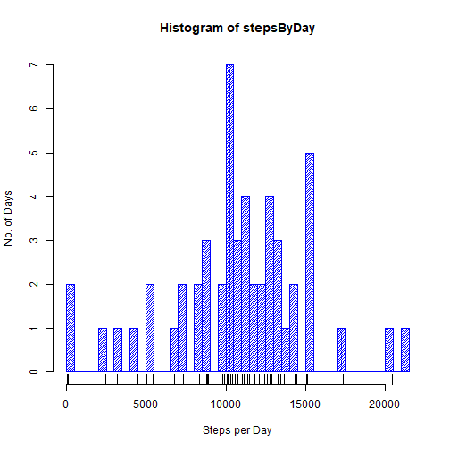
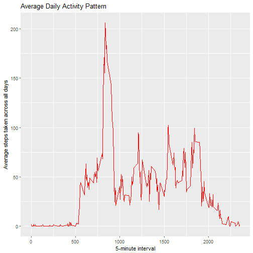
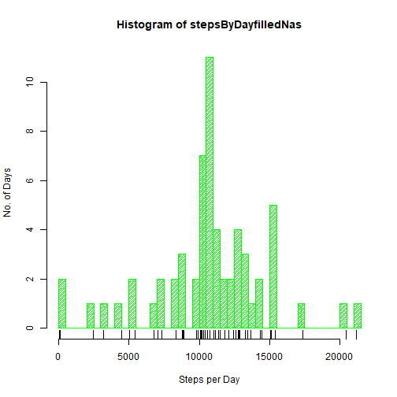

"Reproducible Research Course Project 1"
=======================================


**Setting Global options default to echo code and set working directory and load needed packages**


```r
knitr::opts_chunk$set(echo=TRUE)
knitr::opts_knit$set(root.dir = "~/R_Programs")
library(dplyr)
```

```
## 
## Attaching package: 'dplyr'
```

```
## The following objects are masked from 'package:stats':
## 
##     filter, lag
```

```
## The following objects are masked from 'package:base':
## 
##     intersect, setdiff, setequal, union
```

```r
library(ggplot2)
```

```
## Warning: package 'ggplot2' was built under R version 3.4.2
```

```r
library(lattice)
```


**Create Project's folder in working directory**


```r
if(!file.exists("./RR_Course_Project_1")){
dir.create("./RR_Course_Project_1")
}
```


###Loading and preprocessing the data


####1.Load the data


**Download file if not exists**


```r
if(!file.exists("./RR_Course_Project_1/repdata_data_activity.zip")){
fileUrl <- "https://d396qusza40orc.cloudfront.net/repdata%2Fdata%2Factivity.zip"
download.file(fileUrl, destfile = "./RR_Course_Project_1/repdata_data_activity.zip")
}
```


**Unzip and Load data**


```r
if(!file.exists("./RR_Course_Project_1/activity.csv")){
unzip("./RR_Course_Project_1/repdata_data_activity.zip",exdir ="./RR_Course_Project_1" )
Activitydata<-read.csv("./RR_Course_Project_1/activity.csv")
} else {
Activitydata<-read.csv("./RR_Course_Project_1/activity.csv")
}
```


####2.Process/transform the data (if necessary) into a format suitable for your analysis


```r
Activitydata$date <- as.Date(Activitydata$date, "%Y-%m-%d")
```


###What is mean total number of steps taken per day?


####1. Make a histogram of the total number of steps taken each day


```r
ActivitydataNAsremoved<-Activitydata%>%filter(!is.na(steps))
stepsByDay <- tapply(ActivitydataNAsremoved$steps, ActivitydataNAsremoved$date, sum)
hist(stepsByDay,breaks = 50,col = "blue",density = 40,freq = TRUE,ylab = "No. of Days",xlab = "Steps per Day")
rug(stepsByDay)
```




####2. Calculate and report the mean and median total number of steps taken per day


```r
Meanstepsbyday <- as.integer(mean(stepsByDay))
Medianstepsbyday <- as.integer(median(stepsByDay))
```


**Mean Steps By Day:10766**

**Median Steps By Day:10765**


###What is the average daily activity pattern?


####1.Make a time series plot (i.e.type = "l") of the 5-minute interval (x-axis) and the average number of steps taken, averaged across all days (y-axis)


```r
Activitydatadailypattern<-ActivitydataNAsremoved%>%group_by(interval)%>%summarize( avg_steps = mean(steps))
g<-ggplot(Activitydatadailypattern,aes(interval,avg_steps))
g+geom_line(col="red")+labs(title="Average Daily Activity Pattern")+labs(x="5-minute interval",y="Average steps taken across all days")
```




####2.Which 5-minute interval, on average across all the days in the dataset, contains the maximum number of steps?


```r
intervalmaxsteps<-arrange(Activitydatadailypattern,desc(avg_steps))$interval[1]
maxsteps<-as.integer(arrange(Activitydatadailypattern,desc(avg_steps))$avg_steps[1])
```


**5-Minute Interval on average across all days with max number of steps: 835**

**Number of steps: 206**


###Imputing missing values


####1.Calculate and report the total number of missing values in the dataset


```r
colSums(is.na(Activitydata))
```

```
##    steps     date interval 
##     2304        0        0
```


**We have 2304 rows where Activity steps are missing** 


####2.Devise a strategy for filling in all of the missing values in the dataset


####3.Create a new dataset that is equal to the original dataset but with the missing data filled in

*a.Used the mean steps across all days per 5-minute interval for the 5=minute intervals where steps were missing.*

*b.Created a new dataset 'Activityimputed' and also a new variable 'stepsFilled' which is a dublicate of steps but with filled missing values*


```r
Activityimputed<-merge(Activitydata,Activitydatadailypattern,by.x="interval",by.y="interval")
Activityimputed$stepsFilled<-Activityimputed$steps
Activityimputed$stepsFilled[is.na(Activityimputed$steps)]=Activityimputed$avg_steps[is.na(Activityimputed$steps)]
head(Activityimputed,2)
```

```
##   interval steps       date avg_steps stepsFilled
## 1        0    NA 2012-10-01  1.716981    1.716981
## 2        0     0 2012-11-23  1.716981    0.000000
```


####4.Make a histogram of the total number of steps taken each day and Calculate and report the mean and median total number of steps taken per day.


```r
stepsByDayfilledNas <- tapply(Activityimputed$stepsFilled, Activityimputed$date, sum)
hist(stepsByDayfilledNas,breaks = 50,col = "green",density = 40,freq = TRUE,ylab = "No. of Days",xlab = "Steps per Day")
rug(stepsByDay)
```




```r
Meanstepsbyday2 <- as.integer(mean(stepsByDay))
Medianstepsbyday2 <- as.integer(median(stepsByDay))
```


**Mean Steps By Day with filled missing values:10766 from initial estimate:10766**

**Median Steps By Day with filled missing values:10765 from initial estimate:10765**

*No differences noticed in the mean and median after filling missing values to the initial dataset*


###Are there differences in activity patterns between weekdays and weekends?


####1.Create a new factor variable in the dataset with two levels – “weekday” and “weekend” indicating whether a given date is a weekday or weekend day.


```r
Activityimputed<-mutate(Activityimputed,weekdaytype=factor(1*(as.POSIXlt(Activityimputed$date)$wday %in% c(0,6)),labels=c("weekend","weekday")))
```


####2.Make a panel plot containing a time series plot (i.e.type = "l") of the 5-minute interval (x-axis) and the average number of steps taken, averaged across all weekday days or weekend days (y-axis).


```r
Activitydataperweekdaytype<-Activityimputed%>%group_by(interval,weekdaytype)%>%summarize( avg_steps = mean(stepsFilled))
with( Activitydataperweekdaytype, xyplot( avg_steps ~ interval | weekdaytype, type = "l",layout = c(1,2), 
main = " Average Steps Taken across weekday or weekend days \n per 5-minute interval",
xlab = "5-Min Interval", ylab = "Average Number of Steps"))
```


